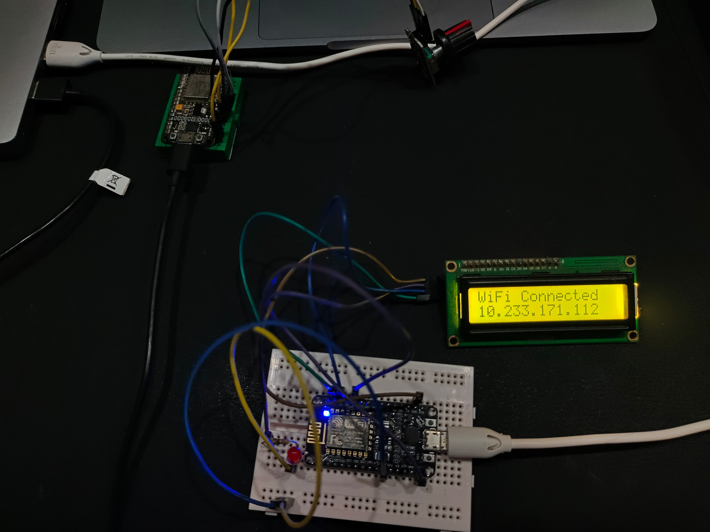
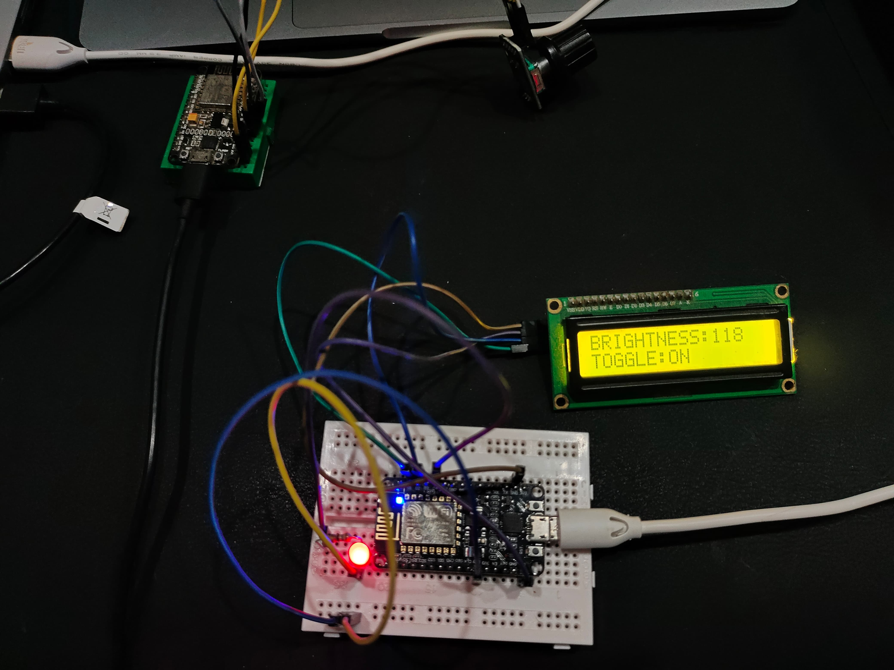
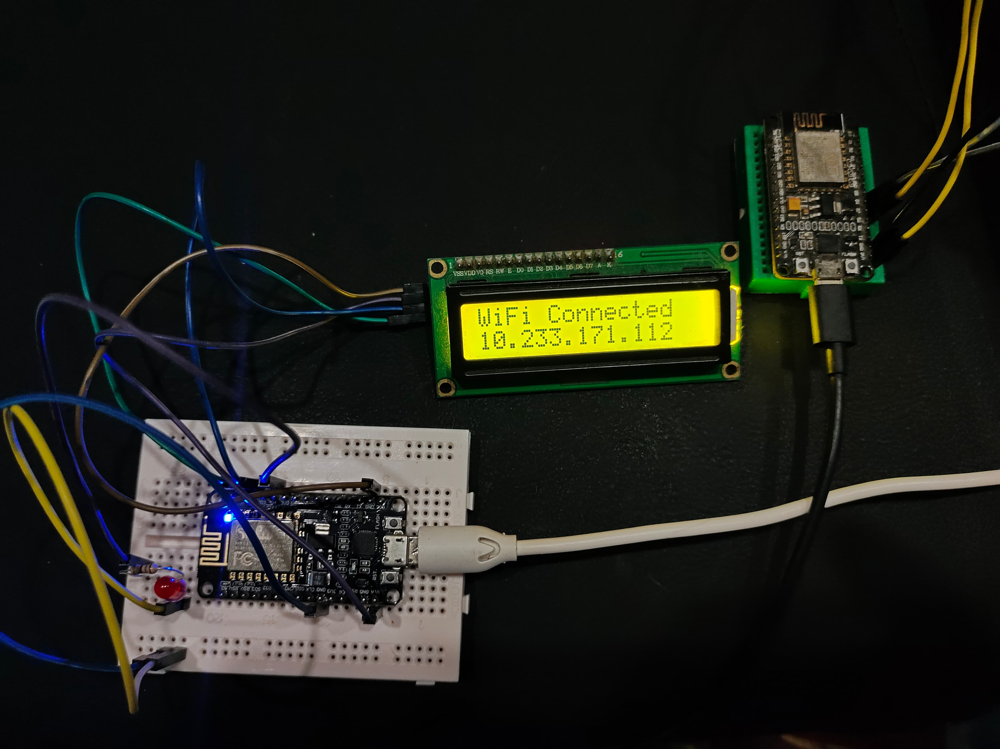
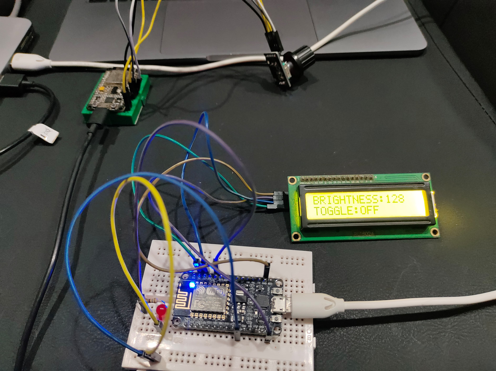

# 🔧 ESP8266 Rotary Encoder LED Control (Client–Server Project)

This project demonstrates a real-time control system using two ESP8266 microcontrollers. One acts as a **client** with a rotary encoder module, while the other acts as a **server** controlling an LED and displaying status on an I2C LCD. Communication happens over **TCP sockets via Wi-Fi**, enabling smooth, responsive control across devices.

---

## 📦 Project Features

- Uses a single **rotary encoder module**:
  - **Rotation** adjusts LED brightness (`BRIGHTNESS:xxx`)
  - **Push button** toggles LED ON/OFF (`TOGGLE:ON/OFF`)
- TCP communication between client and server
- Real-time feedback on I2C LCD
- Debounce and smoothing for clean interaction
- Modular, readable code with serial debugging

---

## 🧠 ESP8266 Hardware Overview

The ESP8266 is a low-cost Wi-Fi-enabled microcontroller ideal for IoT and embedded projects.

| Feature            | Details                          |
|--------------------|----------------------------------|
| **Processor**      | 32-bit Tensilica L106 @ 80 MHz (can be overclocked to 160 MHz) |
| **Flash Memory**   | Typically 4 MB (varies by board) |
| **RAM**            | ~50 KB available for user        |
| **Wi-Fi Module**   | Integrated 802.11 b/g/n (2.4 GHz), supports TCP/IP stack |
| **GPIO Support**   | PWM, I2C, SPI, ADC, UART         |
| **Power Supply**   | 3.3V logic (VIN pin provides 5V from USB) |

---

## 🔌 Wiring Notes

### 🟦 Rotary Encoder (Client Side)
- **CLK** → D5  
- **DT** → D6  
- **SW** → D7  
- **VCC** → 3.3V  
- **GND** → GND  

### 🟨 I2C LCD (Server Side)
Some I2C LCD modules are designed to operate at **5V logic levels**. If you connect the **VCC pin to 3.3V**, the display may flicker, appear dim, or not work at all.

**✅ Recommended fix**: Connect LCD **VCC to VIN** (5V from USB).

| LCD Pin | ESP8266 Pin | Notes                  |
|---------|-------------|------------------------|
| VCC     | VIN (5V)    | Use VIN for full brightness |
| GND     | GND         | Common ground          |
| SDA     | D2          | I2C data               |
| SCL     | D1          | I2C clock              |

---

### ⚙️ I2C Pin Configuration Notes

The ESP8266 uses software-configurable I2C pins, meaning you can reassign SDA/SCL to different GPIOs if needed.

**Default pins in this project**:
- **SDA** → D2 (GPIO4)
- **SCL** → D1 (GPIO5)

**To use different pins**, update the I2C initialization line in your code:

If you want to use different pins:

1.Change the I2C initialization line in the code:

    Wire.begin(SDA_PIN, SCL_PIN);  

Example (using D3 as SDA and D4 as SCL):

    Wire.begin(D3, D4);

2.Update your wiring to match the new pin configuration.

---

## 📡 Wi-Fi Troubleshooting

⚠️ **Misconceptions About Mobile Hotspot IPs**

When both ESP8266 devices are connected to a **mobile hotspot**, they may receive IP addresses in the `10.233.171.xxx` range (or similar). Some people assume this means the devices are on a restricted or carrier-grade NAT network and **cannot communicate directly**.

**✅ Reality**:  
Despite the IP format, devices connected to the same mobile hotspot **can communicate with each other reliably**. This setup works perfectly for local TCP communication between ESP8266 boards.

**💡 Tip**:  
If you're facing issues on institutional or campus Wi-Fi (due to firewalls or client isolation), switching to mobile data is a simple and effective workaround.

---

## 📁 Code Summary

### 🔹 Client (Rotary Encoder Module)
- Reads rotation and button press
- Sends `BRIGHTNESS:xxx` and `TOGGLE:ON/OFF` messages to server
- Debounced and smoothed for clean control
- Automatically reconnects to server if disconnected

### 🔹 Server (LCD + LED)
- Receives TCP messages
- Controls LED brightness via `analogWrite()`
- Displays current state on I2C LCD
- Handles message parsing and whitespace cleanup

---

### 📟 LCD Display Output

The following images show the real-time output from the server-side LCD display, reflecting brightness levels and toggle states as controlled by the rotary encoder module:

  
  
  
  

---

## 🧪 Expansion Ideas

- Add OLED display to client for local feedback
- Use ESP-NOW for peer-to-peer communication
- Add encryption for secure messaging
- Expand to multi-device control (e.g., fan, RGB LED, motor)

---

## 🧑‍💻 Author

**Ragavantiran Gurmoorthy**  
MSc in Electronic & Computer Technology.  
Dublin City University, Dublin, Ireland.  
Passionate about embedded systems, consumer electronics, and creative engineering.

---

Feel free to fork, modify, or build on this project. Contributions and feedback are welcome!
